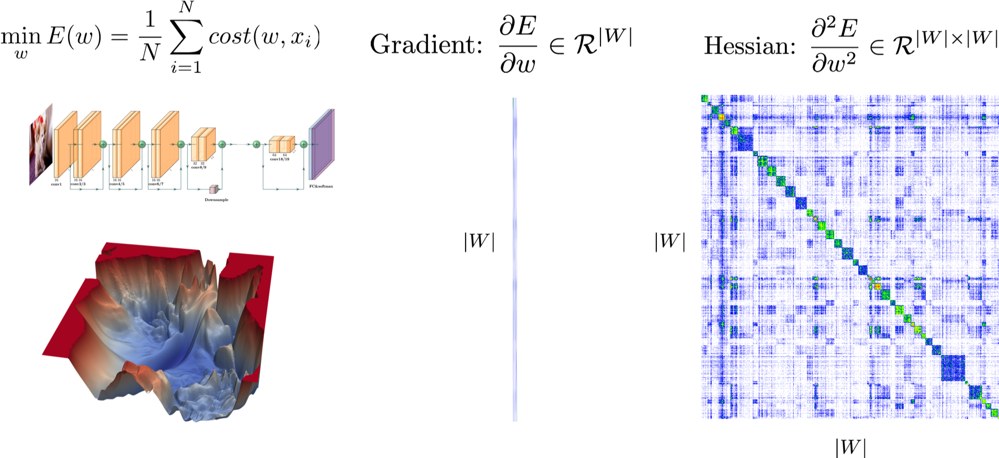

## Introduction
PyHessian is a pytorch library for Hessian based analysis of neural network models. The library enables computing the following metrics:

- Top Hessian eigenvalues
- The trace of the Hessian matrix
- The full Hessian Eigenvalues Spectral Density (ESD)


For more details please see:

- [The Hessian tutorial notebook](./Hessian_Tutorial.ipynb)
- [Video explanation of tutorial](https://www.youtube.com/watch?v=S87ancnZ0MM&feature=youtu.be&t=43m20s)
- [The PyHessian paper](https://arxiv.org/pdf/1912.07145.pdf).


## Publication List
This project was supported through NSF funding and we are interested in documenting related publications
written on or with the help of PyHessian. This will allows us to continue developing the library,
and will also be a good summary for related and on going work on second order methods. [You can see the current list here](publication_list.md).
Please contact us if you have a related paper and we would be glad to add it to the list.


## Usage
### Install from Pip
You can install the library from pip
```
pip install pyhessian
```

### Install from source
You can also compile the library from source
```
git clone https://github.com/amirgholami/PyHessian.git
python setup.py install
```

Before running the Hessian code, we need a (pre-trained) NN model. Here, we provide a training file to train ResNet20 model on Cifar-10 dataset:
```
export CUDA_VISIBLE_DEVICES=0; python training.py [--batch-size] [--test-batch-size] [--epochs] [--lr] [--lr-decay] [--lr-decay-epoch] [--seed] [--weight-decay] [--batch-norm] [--residual] [--cuda] [--saving-folder]

optional arguments:
--batch-size                training batch size (default: 128)
--test-batch-size           testing batch size (default:256)
--epochs                    total number of training epochs (default: 180)
--lr                        initial learning rate (default: 0.1)
--lr-decay                  learning rate decay ratio (default: 0.1)
--lr-decay-epoch            epoch for the learning rate decaying (default: 80, 120)
--seed                      used to reproduce the results (default: 1)
--weight-decay              weight decay value (default: 5e-4)
--batch-norm                do we need batch norm in ResNet or not (default: True)
--residual                  do we need residual connection or not (default: True)
--cuda                      do we use gpu or not (default: True)
--saving-folder             saving path of the final checkpoint (default: checkpoints/)
```

After the model checkpoint is saved, we can run the following code to get the top eigenvalue, trace, and the Eigenvalue Spectral Density of Hessian:
```
export CUDA_VISIBLE_DEVICES=0; python example_pyhessian_analysis.py [--mini-hessian-batch-size] [--hessian-batch-size] [--seed] [--batch-norm] [--residual] [--cuda] [--resume]

optional arguments:
--mini-hessian-batch-size   mini hessian batch size (default: 200)
--hessian-batch-size        hessian batch size (default:200)
--seed                      used to reproduce the results (default: 1)
--batch-norm                do we need batch norm in ResNet or not (default: True)
--residual                  do we need residual connection or not (default: True)
--cuda                      do we use gpu or not (default: True)
--resume                    resume path of the checkpoint (default: none, must be filled by user)
```

The output density plot is saved as example.pdf 


## Citation
PyHessian has been developed as part of the following paper. We appreciate it if you would please cite the following paper if you found the library useful for your work:

* Z. Yao, A. Gholami, K Keutzer, M. Mahoney. PyHessian:  Neural Networks Through the Lens of the Hessian, Spotlight at ICML workshop on Beyond First-Order Optimization Methods in Machine Learning, 2020 (also in proceedings of IEEE Conferenceon big data), [PDF](https://arxiv.org/pdf/1912.07145.pdf).

## Copyright

THIS SOFTWARE AND/OR DATA WAS DEPOSITED IN THE BAIR OPEN RESEARCH COMMONS REPOSITORY ON 02/27/23.
